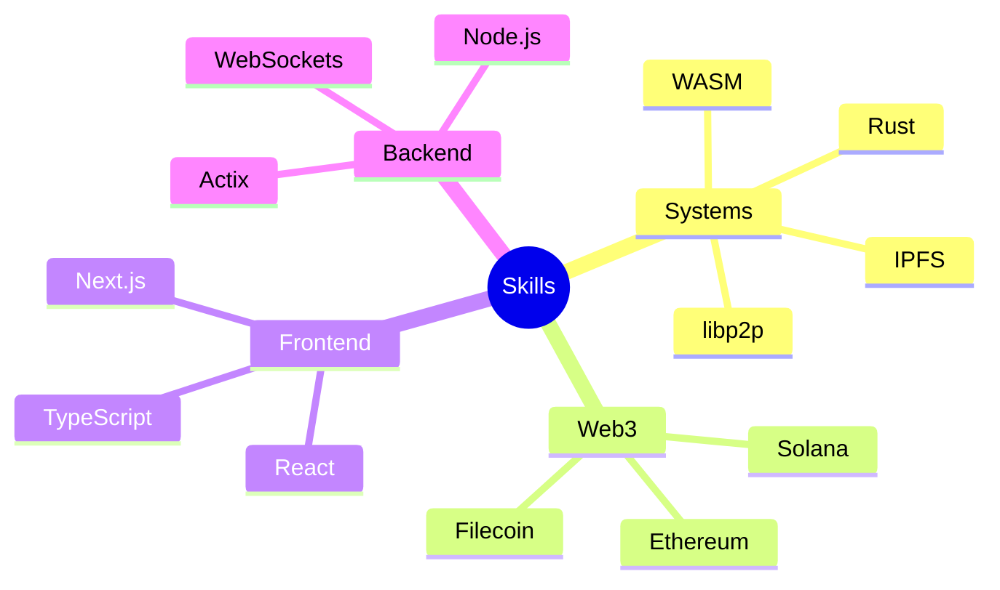

# 🚀 Proof of Work | Vivek Pal

  

## 🧰 Technical Arsenal

## 🏗️ Major Projects

### 🖥️ Operating Systems & Infrastructure

| Project       | Description                                             | Stack                 | Links                                                                      |
| ------------- | ------------------------------------------------------- | --------------------- | -------------------------------------------------------------------------- |
| **ShastraOS** | Decentralized desktop workstation with IPFS integration | `Rust`, `GTK`, `IPFS` | [GitHub](https://github.com/shastraos) \| [Website](https://shastraos.org) |
| **GossipRPC** | P2P RPC implementation using gossipsub                  | `Rust`, `libp2p`      | [GitHub](https://github.com/vivekpal1/gossiprpc)                           |
| **Astra**     | Secured desktop backups system                          | `Rust`, `IPFS`        | [GitLab](https://gitlab.com/shastraos/astra)                               |

### 🌐 Web3 Innovations

| Project      | Description                             | Stack                   | Links                                           |
| ------------ | --------------------------------------- | ----------------------- | ----------------------------------------------- |
| **Catalyst** | Cross-chain asset deposits & purchases  | `Solana`, `Rust`        | [GitHub](https://github.com/vivekpal1/catalyst) |
| **Senshi**   | In-game assets management across chains | `Rust`, `Solana`        | [GitHub](https://github.com/vivekpal1/senshi)   |
| **Sol-Pe**   | Merchant payments dashboard on Solana   | `TypeScript`, `Next.js` | [Website](https://solpe.co/)                    |

### 🛠️ Developer Tools & Applications

| Project | Description | Stack | Links |
|---------|-------------|-------|-------|
| **Chat P2P** | Decentralized chat using libp2p | `Rust`, `WASM`, `libp2p` | [GitHub](https://github.com/vivekpal1/chat-p2p) |
| **MarkitDown** | Markdown note-taking web app | `TypeScript`, `React` | [Live Demo](https://markitdown.vercel.app/) |
| **videoVR** | VR video player | `WebVR`, `Three.js` | [GitHub](https://github.com/vivekpal1/videoVR) |

## 🤝 Open Source Contributions

### Active Contributions

| Project | Role | Contributions |
|---------|------|---------------|
| **GNOME** | Contributor | Desktop environment components, GTK applications |
| **FOSSCU** | Maintainer | Community management, FOSS advocacy |
| **Cubik** | Contributor | Solana initiatives platform |

### Impact Metrics

- 📊 **200+** FOSSCU community members
- 🔨 **50+** Pull requests merged
- 🌟 **500+** GitHub contributions in the last year
- 🏆 **5** Hackathon wins

## 🎯 Recent Achievements

- 🏅 **Superteam Member** - Elite web3 builders community
- 🌟 **Wormhole Fellow** - Selected for the Wormhole Fellowship Program
- 🚀 **Solana Hackathon Winner** - For Solway project

## 📚 Technical Writing

| Topic | Platform | Link |
|-------|----------|------|
| Circular Economy for Parallel States | Blog | [Read More](https://vivekpal.in/blog/circular-economy) |
| Creating Custom Kernel Modules | Technical Guide | [Read More](https://vivekpal.in/blog/kernel-modules) |
| Modular Systems for Communities | Research | [Read More](https://vivekpal.in/blog/modular-systems) |

## 🌐 Community Impact

### Technical Workshops

| Topic                       | Audience | Date |
| --------------------------- | -------- | ---- |
| Linux System Administration | FOSSCU   | 2023 |
| WASI                        | JSConf   | 2023 |
| Custom Kernel Modules       | FOSSCU   | 2023 |

### Mentorship

- 👨‍🏫 Mentored 20+ developers in systems programming
- 🎓 Conducted workshops on Linux and FOSS
- 💡 Guided 5+ projects from ideation to deployment

## 📫 Connect With Me

---

  
*Building the decentralized future, one commit at a time* 🚀

